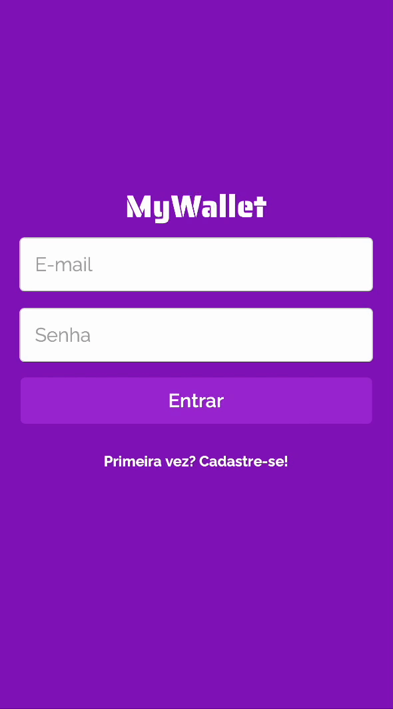

# MyWalletBack

Design of a wallet manager application! You can register, describe earns/expenses, and get the amount!
It's very useful to balance expenses and save money.



Try it out now at https://mywallet-front-82nez58km-isaias-s-projects.vercel.app/.
Check out the FrontEnd on https://github.com/isaiassf22/Mywallet-frontEnd.

## About

This is the Back-end of my first full-stack web application ! Using MongoDB ! It's mainly made to manage money. Below are the implemented features:

- Sign Up
- Login
- List all earns/spendings (describing) to manage your money
- Add input of money
- Add output of money
- LogOut

By using this app any user can keep track of their money !

## Technologies
The following tools and frameworks were used in the construction of the project, you can find the full list on the package.json:<br>
<p>
  
  
  
  
  
  
  

  
</p>

## How to run

1. Clone this repository
2. Install  all dependencies
```bash
npm i
```
3. Create a .env file on the root of the project with the following variables
```bash
DATABASE_URL=yourDataBaseURL
PORT=YourBackEndPORT
```
3. Run the back-end with
```bash
npm start
```
4. You can optionally run the project with auto reload after changes
```bash
npm run dev
```
5. Finally send a request to http://localhost:YourBackEndPORT/RouteImplemented and see it running !
